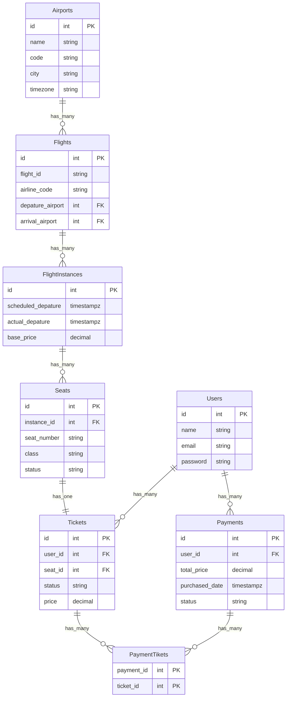

# Ticket Selling System

A minimal MVP demonstrating database transactions and resource contention.

## TeamMembers

- Wai Lin Aung
- Tom Everson

## Overview

Users compete to purchase tickets from a limited inventory. The system ensures data consistency through ACID transactions, preventing overselling and race conditions.

## Key Features

- **Limited Inventory**: Fixed ticket supply with concurrent purchase attempts
- **Transactions**: ACID-compliant operations to maintain consistency
- **Race Condition Handling**: Prevents double-booking through locking/serialization

